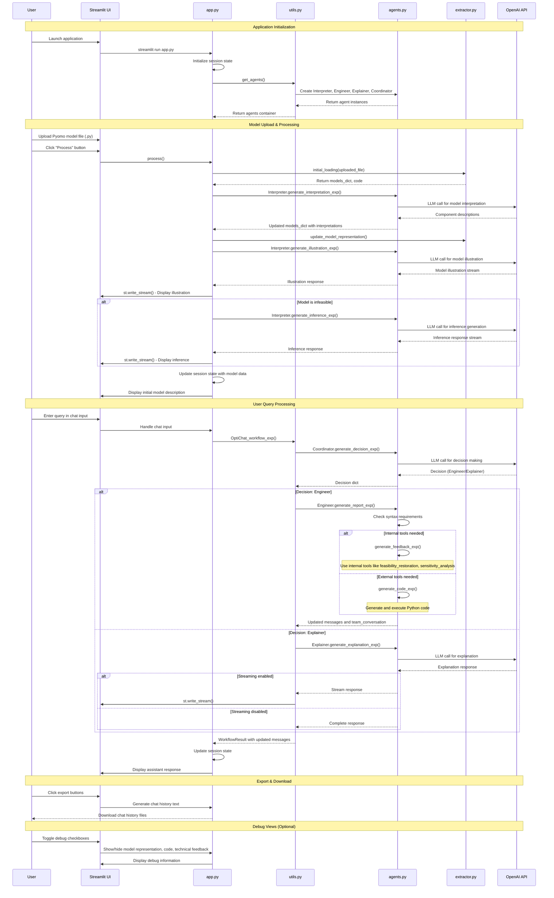

# OptiChat: Interactive Optimization Model Analysis Platform

## Table of Contents

1. [Introduction & Overview](#introduction--overview)
2. [System Architecture](#system-architecture)
3. [System Workflows](#system-workflows)
4. [User Experience](#user-experience)
5. [Technical Implementation](#technical-implementation)
6. [Setup & Configuration](#setup--configuration)
7. [Operations & Maintenance](#operations--maintenance)

---

## Introduction & Overview

### What is OptiChat?

OptiChat is an innovative Streamlit-based web application that bridges the gap between optimization modeling and natural language interaction. It enables users to upload Pyomo optimization models and interact with them through conversational AI, making complex optimization problems more accessible and understandable.

### Key Features

- **Multi-Agent Architecture**: Four specialized AI agents (Interpreter, Engineer, Explainer, Coordinator) work together to provide comprehensive analysis and responses
- **Natural Language Interface**: Users can ask questions about their optimization models in plain English
- **Model Interpretation**: Automatic extraction and interpretation of Pyomo model components (variables, constraints, objectives)
- **Interactive Analysis**: Real-time code generation and execution for custom analysis tasks
- **Infeasibility Diagnosis**: Intelligent analysis of infeasible models with suggestions for resolution
- **Export Capabilities**: Download chat history and technical feedback for documentation purposes

### Target Audience

OptiChat is designed for:

- Operations researchers and optimization practitioners
- Data scientists working with mathematical programming
- Students learning optimization modeling
- Business analysts who need to understand optimization results
- Anyone who wants to interact with Pyomo models without deep technical expertise

### Technology Stack

- **Frontend**: Streamlit for interactive web interface
- **Backend**: Python with Pyomo for optimization modeling
- **AI Integration**: OpenAI GPT models for natural language processing
- **Model Processing**: Custom extraction and interpretation pipeline
- **Session Management**: Streamlit session state for persistent conversations

---

## System Architecture

### Multi-Agent Architecture Overview

OptiChat employs a sophisticated multi-agent system where four specialized AI agents collaborate to provide comprehensive analysis and user support. Each agent has distinct responsibilities and expertise:

#### Interpreter Agent

- **Primary Role**: Model analysis and interpretation
- **Key Functions**:
  - Extracts and interprets Pyomo model components (variables, constraints, objectives)
  - Generates natural language descriptions of optimization models
  - Creates user-friendly illustrations of model structure and purpose
  - Analyzes infeasible models and provides diagnostic insights
- **When Active**: During initial model processing and when users need model explanations

#### Engineer Agent

- **Primary Role**: Technical analysis and code execution
- **Key Functions**:
  - Performs complex mathematical and computational analysis
  - Generates and executes Python code for custom analysis tasks
  - Uses internal tools for sensitivity analysis, feasibility restoration, and model modifications
  - Handles technical queries requiring computational solutions
- **When Active**: When users ask technical questions or request specific analyses

#### Explainer Agent

- **Primary Role**: User communication and explanation synthesis
- **Key Functions**:
  - Translates technical analysis into user-friendly explanations
  - Synthesizes information from other agents into coherent responses
  - Provides educational content about optimization concepts
  - Ensures responses are accessible to users with varying technical backgrounds
- **When Active**: When users need explanations or clarifications about results

#### Coordinator Agent

- **Primary Role**: Workflow orchestration and decision making
- **Key Functions**:
  - Analyzes user queries to determine the most appropriate responding agent
  - Routes requests to Engineer or Explainer based on query complexity and nature
  - Manages the overall conversation flow and agent interactions
  - Prevents infinite loops and ensures efficient query resolution
- **When Active**: For every user query to make routing decisions

### Key Design Patterns

#### Multi-Agent Coordination

The application implements a coordinated multi-agent system where:

- Each agent has specialized capabilities and prompts
- The Coordinator makes intelligent routing decisions
- Agents can communicate through the team conversation mechanism

#### Streaming Interface

- Real-time response generation enhances user experience
- Configurable streaming allows for different interaction modes
- Stream processing integrates seamlessly with Streamlit's UI components

#### Experimental Configuration

- The `ExperimentArgs` type enables research and experimentation
- Flexible parameter control for different analysis scenarios
- Support for both internal and external experimental modes

---

## System Workflows

### System Flow Diagram



### Detailed Process Flow

#### 1. Application Initialization

- **User launches the application** via `streamlit run app.py`
- **Session state initialization**: The app initializes various session state variables including temperature settings, streaming options, and empty containers for messages and model data
- **Agent creation**: The `get_agents()` function creates four specialized agents:
  - `Interpreter`: Handles model interpretation and illustration
  - `Engineer`: Manages technical analysis and code generation
  - `Explainer`: Provides user-friendly explanations
  - `Coordinator`: Makes decisions about which agent should handle queries

#### 2. Model Upload and Processing

When a user uploads a Pyomo model file and clicks "Process":

##### 2.1 Initial Loading

- `initial_loading()` function processes the uploaded file
- Extracts the Pyomo model structure and code
- Returns `models_dict` containing model information and the source `code`

##### 2.2 Model Interpretation

- `Interpreter.generate_interpretation_exp()` analyzes model components
- Makes LLM calls to OpenAI API to generate descriptions for model components
- Updates `models_dict` with component interpretations using `update_model_representation()`

##### 2.3 Model Illustration

- `Interpreter.generate_illustration_exp()` generates a natural language description
- Streams the illustration to the user interface using `st.write_stream()`
- Creates user-friendly explanations of the optimization model structure

##### 2.4 Infeasibility Handling (Optional)

- If the model is infeasible (status: `TerminationCondition.infeasible` or `TerminationCondition.infeasibleOrUnbounded`)
- `Interpreter.generate_inference_exp()` generates additional analysis
- Provides insights about potential causes of infeasibility

#### 3. User Query Processing

The main interaction loop begins when users submit queries:

##### 3.1 Query Reception

- User enters a query in the chat input
- Query is added to the conversation history in session state

##### 3.2 Workflow Orchestration

- `OptiChat_workflow_exp()` orchestrates the multi-agent workflow
- Implements a maximum round limit to prevent infinite loops

##### 3.3 Decision Making

- `Coordinator.generate_decision_exp()` analyzes the query
- Makes an LLM call to determine which agent should handle the request
- Returns a decision dictionary specifying either "Engineer" or "Explainer"

##### 3.4 Agent-Specific Processing

###### Engineer Path

When the Coordinator selects the Engineer:

- `Engineer.generate_report_exp()` handles technical queries
- **Syntax Analysis**: Determines if internal or external tools are needed
- **Internal Tools**: Uses predefined functions like:
  - `feasibility_restoration`
  - `sensitivity_analysis`
  - `components_retrieval`
  - `evaluate_modification`
- **External Tools**: Generates and executes Python code for complex analysis
- **Code Generation**: `generate_code_exp()` creates custom analysis code
- Updates both `messages` and `team_conversation` with results

###### Explainer Path

When the Coordinator selects the Explainer:

- `Explainer.generate_explanation_exp()` synthesizes technical feedback
- Converts technical analysis into user-friendly explanations
- Supports both streaming and non-streaming responses based on configuration
- Uses conversation history and team feedback to generate comprehensive explanations

##### 3.5 Response Generation

- Selected agent generates appropriate response
- Response is either streamed in real-time or returned as complete text
- Session state is updated with new messages and conversation history

#### 4. Advanced Features

##### 4.1 Team Conversation Tracking

- `TeamConversationMessage` objects track internal agent communications
- Provides transparency into the multi-agent decision-making process
- Can be displayed via the "Show Technical Feedback" debug option

##### 4.2 Export Functionality

- Users can export chat history in two formats:
  - **Basic Chat History**: User queries and assistant responses
  - **Detailed Chat History**: Includes all internal agent communications
- Files are downloadable as `.txt` format

##### 4.3 Debug Views

The application provides optional debug interfaces:

- **Model Representation**: JSON view of the parsed model structure
- **Source Code**: Display of the original Pyomo code
- **Technical Feedback**: Internal agent communications and analysis steps

##### 4.4 Configuration Options

- **LLM Model Selection**: Support for various GPT models including GPT-4, GPT-3.5, and experimental models
- **Temperature Control**: Configurable creativity/randomness in responses
- **Streaming Options**: Individual control over streaming for different agent types
- **JSON Mode**: Structured output formatting for technical responses

#### 5. Error Handling and Logging

- `@logger.catch` decorators provide comprehensive error logging
- Graceful handling of LLM failures with fallback responses
- Validation of agent decisions and responses
- User-friendly error messages for common issues (missing files, API errors)

#### 6. Session State Management

The application maintains persistent state across user interactions:

- **Model Data**: Parsed model structure and metadata
- **Conversation History**: Complete message history for context
- **Agent Instances**: Persistent agent objects with accumulated metrics
- **Configuration Settings**: User preferences and experimental parameters

---

## User Experience

### User Journey Examples

#### Example 1: Model Analysis Workflow

1. **Upload Model**: User uploads a production scheduling Pyomo model
2. **Initial Analysis**: Interpreter agent provides model overview and component descriptions
3. **Query Variables**: User asks "What are the decision variables in this model?"
4. **Technical Analysis**: Engineer agent extracts and explains variable definitions
5. **Follow-up**: User asks "Can you show me the capacity constraints?"
6. **Explanation**: Explainer agent provides user-friendly constraint explanations

#### Example 2: Infeasibility Diagnosis

1. **Upload Infeasible Model**: User uploads a model that cannot be solved
2. **Automatic Detection**: System detects infeasibility status
3. **Diagnostic Analysis**: Interpreter generates inference about potential causes
4. **User Query**: "Why is my model infeasible?"
5. **Deep Analysis**: Engineer performs feasibility restoration analysis
6. **Recommendations**: Explainer provides actionable suggestions for model fixes

#### Example 3: Model Modification Assistance

1. **Model Understanding**: User explores existing transportation model
2. **Modification Request**: "How can I add a new distribution center?"
3. **Code Generation**: Engineer generates Python code for model modification
4. **Implementation Guidance**: Explainer walks through the modification process
5. **Validation**: User tests the modified model with system assistance

### Supported Model Types

#### Optimization Problem Classes

- **Linear Programming (LP)**: Continuous variables with linear constraints and objectives
- **Mixed Integer Programming (MIP)**: Combination of continuous and integer variables
- **Mixed Integer Linear Programming (MILP)**: Integer variables with linear relationships
- **Nonlinear Programming (NLP)**: Models with nonlinear constraints or objectives
- **Mixed Integer Nonlinear Programming (MINLP)**: Complex models with both integer and nonlinear components

#### Pyomo Model Requirements

- Models must be defined using Pyomo framework
- Support for both concrete and abstract model formulations
- Compatible with standard Pyomo components (Var, Constraint, Objective, Param, Set)
- Models should include proper solver configuration

#### Solver Compatibility

- **Open Source**: GLPK, CBC, Ipopt, Bonmin
- **Commercial**: Gurobi, CPLEX, Xpress (with appropriate licenses)
- **Cloud-based**: NEOS server integration supported
- Automatic solver detection and recommendation based on model type

#### Model Size Considerations

- **Small Models**: < 1000 variables, optimal performance
- **Medium Models**: 1000-10000 variables, good performance with some latency
- **Large Models**: > 10000 variables, may require processing time limits
- Memory usage scales with model complexity and constraint density

---

## Technical Implementation

### Technical Feedback by Agent

Each agent in the OptiChat system provides specific types of technical feedback through their specialized methods:

#### 1. Interpreter Agent Technical Feedback

The Interpreter agent provides model understanding and structural analysis feedback:

**`generate_interpretation_exp()` returns:**

- **Component descriptions**: Natural language descriptions of model sets, parameters, variables, constraints, and objectives
- **Model structure analysis**: JSON-formatted component interpretations integrated into the model dictionary
- **Success/failure status**: Retry count and task completion flags for robustness

**`generate_illustration_exp()` returns:**

- **Model overview**: User-friendly explanation of the optimization model's purpose and structure
- **Component relationships**: How different model components interact and contribute to the optimization goal

**`generate_inference_exp()` returns:**

- **Infeasibility analysis**: Detailed explanation of why a model is infeasible or unbounded
- **Diagnostic insights**: Potential causes and suggested fixes for problematic models

#### 2. Engineer Agent Technical Feedback

The Engineer agent provides the most comprehensive technical analysis through multiple specialized methods:

**`generate_report_exp()` orchestrates technical workflows and returns:**

- **Complete technical analysis**: Coordinates syntax analysis, tool execution, and code generation
- **Updated conversation history**: Both user messages and detailed team conversation with technical results

**`generate_feedback_exp()` executes internal tools and returns:**

- **Tool execution results**: Direct output from internal analysis functions
- **Error handling**: Detailed error messages with problematic components when tools fail
- **Retry logic**: Automated recovery mechanisms for robust analysis

**Internal Tools Technical Feedback:**

- **`feasibility_restoration()` provides:**

  - Parameter changes needed to restore feasibility
  - New model status after modifications
  - Slack variable analysis showing minimal changes required
  - Recommendations for feasibility improvement strategies

- **`sensitivity_analysis()` provides:**

  - Impact of parameter changes on optimal objective value
  - Dual value calculations and economic interpretations
  - Parameter sensitivity coefficients
  - Recommendations for parameter importance analysis

- **`components_retrieval()` provides:**

  - Current values of parameters, variables, and sets
  - Constraint expressions and objective function details
  - Component descriptions with physical meanings
  - Index-specific component information

- **`evaluate_modification()` provides:**
  - Description of specific modifications made to the model
  - New model status and objective value after changes
  - Comparison with original model performance
  - Analysis of modification impacts and trade-offs

**`generate_code_exp()` provides:**

- **Generated Python code**: Custom analysis code for complex queries
- **Execution results**: Output from running generated code with error handling
- **Code evaluation**: Assessment of code quality and results validation

#### 3. Explainer Agent Technical Feedback

The Explainer agent synthesizes technical information into accessible explanations:

**`generate_explanation_exp()` returns:**

- **User-friendly explanations**: Technical results translated into accessible language
- **Synthesized analysis**: Combines technical feedback from Engineer and other agents
- **Educational content**: Explanations of optimization concepts and results interpretation
- **Contextual responses**: Tailored to user's technical background and query complexity

#### 4. Coordinator Agent Technical Feedback

The Coordinator agent provides workflow management and routing decisions:

**`generate_decision_exp()` returns:**

- **Routing decisions**: Which agent should handle specific queries (`DecisionDict`)
- **Task assignments**: Specific tasks for selected agents (e.g., "explain the technical feedback")
- **Workflow status**: Progress tracking through multi-agent collaboration
- **Process coordination**: Prevention of infinite loops and efficient query resolution

#### Technical Feedback Structure

All technical feedback is captured in `TeamConversationMessage` objects with the following structure:

```python
{
    "agent_name": str,     # Name of the responding agent
    "agent_response": str  # The technical feedback content
}
```

The feedback flows through the system in a coordinated manner:

1. **Engineer** generates detailed technical analysis using internal tools or code generation
2. **Coordinator** makes routing decisions and manages workflow progression
3. **Explainer** synthesizes technical feedback into user-friendly responses
4. **Interpreter** provides model understanding and structural analysis

This multi-agent architecture ensures users receive both comprehensive technical analysis and accessible explanations tailored to their specific needs and technical background.

### Performance Considerations

#### Model Processing Performance

- **Small Models** (< 100 components): < 5 seconds processing time
- **Medium Models** (100-1000 components): 5-30 seconds processing time
- **Large Models** (> 1000 components): 30+ seconds, may require patience

#### Response Generation Speed

- **Streaming Mode**: Real-time token generation, immediate feedback
- **Standard Mode**: Complete response generation, 2-10 seconds typical
- **Complex Analysis**: Code generation and execution, 10-60 seconds
- **Network Dependent**: API latency affects overall responsiveness

#### Memory Usage

- Base application: ~50MB RAM
- Model storage: Varies with complexity (1-100MB per model)
- Session data: Cumulative conversation history
- Peak usage during code execution phases

#### Scalability Considerations

- Single-user application design
- Session isolation through Streamlit state management
- Concurrent model processing not supported
- Resource cleanup between sessions

---

## Setup & Configuration

### Installation & Setup Guide

#### Prerequisites

- **Python**: Version 3.8 or higher
- **Operating System**: Windows, macOS, or Linux
- **Memory**: Minimum 4GB RAM, 8GB recommended for larger models
- **Internet Connection**: Required for OpenAI API access

#### Installation Steps

##### 1. Clone Repository

```bash
git clone https://github.com/flect-kfukui/OptiChat.git
cd OptiChat
```

##### 2. Install Dependencies

```bash
# Using uv (recommended)
uv sync

# Or using pip
pip install -r requirements.txt
```

##### 3. Environment Configuration

Create a `.env` file in the project root

##### 4. Launch Application

```bash
streamlit run app.py
```

##### 5. Access Interface

Open your web browser and navigate to `http://localhost:8501`

#### Configuration Options

- **Model Selection**: Choose between GPT-3.5, GPT-4, or experimental models
- **Temperature Settings**: Adjust response creativity (0.0-1.0)
- **Streaming**: Enable/disable real-time response generation
- **Debug Mode**: Show technical feedback and internal communications

### API Integration Details

#### OpenAI Integration

- **Supported Models**: GPT-3.5-turbo, GPT-4, GPT-4-turbo, experimental models
- **Token Limits**: Automatic management with context truncation when necessary
- **Rate Limiting**: Built-in retry logic with exponential backoff
- **Cost Optimization**: Efficient prompt engineering to minimize token usage

#### API Key Management

- Secure environment variable storage
- No API keys stored in session state or logs
- Support for organization-specific API keys
- Automatic key validation on startup

#### Fallback Mechanisms

- Graceful degradation when API is unavailable
- Cached responses for common queries
- Local processing for basic model analysis
- User notification of service limitations

#### Usage Monitoring

- Token consumption tracking per session
- Cost estimation for user awareness
- Usage analytics for optimization
- Rate limit status monitoring

---

## Operations & Maintenance

### Security & Privacy

#### Data Handling

- **Model Files**: Processed locally, not permanently stored
- **Conversations**: Kept in session state only, cleared on restart
- **API Communications**: Encrypted HTTPS connections
- **No Persistent Storage**: User data not saved to disk

#### API Key Security

- Environment variable storage only
- Never logged or displayed in UI
- Separate keys per user/organization supported
- Regular key rotation recommended

#### Privacy Protection

- No user data sent to third parties (except OpenAI API)
- Model content processed with privacy in mind
- Session isolation prevents data leakage
- Optional local processing for sensitive models

#### Best Practices

- Use dedicated API keys for production
- Regularly update dependencies
- Monitor API usage for anomalies
- Implement network security measures in deployment

### Troubleshooting

#### Common Issues

##### Model Upload Failures

- **Issue**: "Failed to process model file"
- **Solutions**:
  - Ensure file is valid Python with Pyomo model
  - Check for syntax errors in uploaded file
  - Verify model uses supported Pyomo components
  - Try smaller test model first

##### API Connection Problems

- **Issue**: "OpenAI API error" or timeout messages
- **Solutions**:
  - Verify API key is correct and active
  - Check internet connectivity
  - Confirm API quota/billing status
  - Try reducing model complexity

##### Agent Response Delays

- **Issue**: Long waiting times for responses
- **Solutions**:
  - Enable streaming mode for faster feedback
  - Simplify complex queries
  - Check system resource usage
  - Restart application if memory usage is high

##### Infeasibility Analysis Errors

- **Issue**: Cannot analyze infeasible models
- **Solutions**:
  - Ensure solver is properly configured
  - Check model has been attempted to solve
  - Verify model components are properly defined
  - Try manual solve before upload

#### Debug Features

- **Show Model Representation**: View parsed model structure
- **Show Source Code**: Display original model code
- **Show Technical Feedback**: Internal agent communications
- **Temperature Control**: Adjust response creativity
- **Streaming Toggle**: Enable/disable real-time responses

#### Performance Optimization

- Close unused browser tabs to free memory
- Restart application periodically for fresh session
- Use smaller models for testing and learning
- Enable streaming for better perceived performance

### Extension Points

#### For Developers

##### Adding New Internal Tools

Create new functions in `internal_tools.py`:

```python
def custom_analysis_tool(model_dict, query_params):
    """Custom analysis implementation"""
    # Your analysis logic here
    return analysis_results
```

Register in agent prompt systems and tool selection logic.

##### Creating Custom Agents

Extend the base agent class in `agents.py`:

```python
class CustomAgent(BaseAgent):
    def __init__(self, name, system_prompt):
        super().__init__(name, system_prompt)

    def generate_response(self, query, context):
        # Custom agent logic
        return response
```

##### Extending Extraction Pipeline

Modify `extractor.py` to handle new model types:

```python
def extract_custom_components(model):
    """Extract custom model components"""
    # Component extraction logic
    return component_dict
```

##### Adding Export Formats

Extend export functionality in `app.py`:

```python
def export_custom_format(conversation_history):
    """Generate custom export format"""
    # Format conversion logic
    return formatted_content
```

#### Integration Opportunities

- **Jupyter Notebook Extension**: Integrate OptiChat into notebook environments
- **IDE Plugins**: VS Code or PyCharm extensions for model analysis
- **Web API**: REST API for programmatic access
- **Database Integration**: Store and retrieve model libraries
- **Collaboration Features**: Multi-user model sharing and discussion

#### Research Applications

- **Prompt Engineering**: Experiment with different agent prompts
- **Model Comparison**: Analyze different optimization formulations
- **Educational Tools**: Create learning modules for optimization concepts
- **Automated Documentation**: Generate technical documentation from models
