# OptiChat Workflow Sequence Diagram

This diagram shows the interactions between agents in the `OptiChat_workflow_exp()` function.

```mermaid
sequenceDiagram
    participant User
    participant Workflow as OptiChat Workflow
    participant Coord as Coordinator
    participant Eng as Engineer
    participant Expl as Explainer
    participant LLM as Language Model

    User->>Workflow: Request with messages & models_dict

    Note over Workflow: Initialize timing counters
    Workflow->>Workflow: Set coordination_time = 0<br/>Set syntax_time = 0<br/>Set programming_time = 0<br/>Set evaluation_time = 0<br/>Set explanation_time = 0

    Note over Workflow: Start main loop (max_rounds)
    loop Until max_rounds or completion

        Note over Workflow,Coord: Coordination Phase
        Workflow->>Coord: generate_decision_exp(args, messages, team_conversation)
        Coord->>LLM: Analyze request and decide agent
        LLM-->>Coord: Decision result
        Coord-->>Workflow: DecisionDict{agent_name, task}

        alt Decision is None
            Workflow->>User: Error: "LLM failed"
            Note over Workflow: Return WorkflowResult

        else Agent is "Engineer"
            Note over Workflow,Eng: Engineering Analysis Phase
            Workflow->>Eng: generate_report_exp(args, messages, team_conversation, models_dict)

            Note over Eng: Initialize counters
            Eng->>Eng: _init_cnt()

            alt External Experiment Mode
                Note over Eng: Skip syntax analysis
                Eng->>Eng: syntax_output = "external_tools"<br/>syntax_mode = "none"
            else Internal Analysis
                Note over Eng: Syntax Analysis Phase
                Eng->>Eng: generate_syntax_exp(args, messages, team_conversation, models_dict)
                Eng->>LLM: Syntax guidance request
                LLM-->>Eng: Syntax analysis result
                Eng->>Eng: Update syntax_time
            end

            alt Syntax Success
                alt Not External Tools
                    Note over Eng: Add code & syntax reminders to team_conversation
                    Eng->>Eng: generate_feedback_exp(args, messages, team_conversation, models_dict, syntax_mode)

                    Note over Eng: Tool Calling Phase
                    Eng->>Eng: tool_call_exp() with appropriate tools
                    Eng->>LLM: Function calling with tools
                    LLM-->>Eng: Tool execution results

                    Note over Eng: Clean up temporary reminders
                    Eng->>Eng: Remove Code & Syntax reminders from team_conversation

                    alt Operator Success
                        Note over Eng: Add successful tool results
                    else Operator Failed
                        Eng->>Eng: Set syntax_output = "external_tools"
                    end
                end

                alt Need Code Generation (syntax_output == "external_tools")
                    Note over Eng: Code Generation Phase
                    Eng->>Eng: generate_code_exp(args, messages, team_conversation, models_dict)

                    Note over Eng: Programmer Loop
                    loop Until programmer success or max attempts
                        Eng->>Eng: programmer_loop_exp(pseudo_messages)
                        Eng->>LLM: Code generation request
                        LLM-->>Eng: Generated code
                        Eng->>Eng: Update programming_time
                    end

                    Note over Eng: Code Execution
                    Eng->>Eng: execute_code(revision_code, print_code)

                    Note over Eng: Evaluator Loop
                    loop Until evaluator success or max attempts
                        Eng->>Eng: evaluator_loop_exp(pseudo_messages)
                        Eng->>LLM: Code evaluation request
                        LLM-->>Eng: Evaluation result
                        Eng->>Eng: Update evaluation_time
                    end

                    Note over Eng: Add results to conversation
                    Eng->>Eng: team_conversation.append(Programmer result)
                    Eng->>Eng: team_conversation.append(Execution result)
                    Eng->>Eng: team_conversation.append(Evaluator result)
                end
            else Syntax Failed
                Note over Eng: Add syntax reminder to conversation
            end

            Eng-->>Workflow: Updated messages & team_conversation

        else Agent is "Explainer"
            Note over Workflow,Expl: Explanation Phase
            Workflow->>Expl: generate_explanation_exp(args, messages, team_conversation)
            Expl->>LLM: Generate explanation
            LLM-->>Expl: Explanation response
            Expl-->>Workflow: Stream or string response

            Note over Workflow: Update explanation_time
            Workflow->>Workflow: team_conversation.append(Explainer response)
            Workflow->>Workflow: messages.append(assistant message)
            Workflow->>User: Final explanation response
            Note over Workflow: Return WorkflowResult
        end

        Note over Workflow: Increment rounds
    end

    alt Max Rounds Reached
        Workflow->>User: Return partial results
    end
```

## Key Components

### Agents

- **Coordinator**: Decides which agent should handle the current request
- **Engineer**: Performs technical analysis including syntax checking, tool calling, and code generation
- **Explainer**: Provides natural language explanations of results

### Engineer Workflow Phases

1. **Syntax Analysis**: Analyzes the optimization model's component structure and generates syntax guidance for tool usage
   - Examines model components (variables, parameters, constraints, objectives)
   - Determines the appropriate indexing mode based on component structure:
     - `multiple`: Components with multiple index specifications (e.g., `x[i,j,k]`)
     - `single`: Components with single index specifications (e.g., `y[i]`)
     - `none`: Non-indexed components (e.g., scalar variables)
   - Identifies component names and types that need to be referenced
   - Generates guidance on proper syntax for accessing model components in analysis tools
   - Validates that the user's query can be mapped to available model components
2. **Tool Calling**: Executes specialized built-in tools for optimization analysis
   - **feasibility_restoration**: Finds minimal parameter changes to restore feasibility
   - **sensitivity_analysis**: Analyzes parameter impact on optimal objective values
   - **components_retrieval**: Retrieves current values and expressions of model components
   - **evaluate_modification**: Evaluates specific parameter modification impacts
   - Tool selection based on user query intent and model component structure
3. **Code Generation**: Creates custom Python code when built-in tools are insufficient for the analysis
   - Triggered when syntax analysis determines "external_tools" mode is needed
   - Uses iterative programmer loop with multiple attempts for code refinement
   - Generates executable Python code that interfaces with optimization models
   - Handles complex scenarios requiring custom analysis beyond standard tool capabilities
4. **Code Execution**: Runs generated code and captures results
5. **Code Evaluation**: Evaluates code correctness and output (Evaluator loop)

### Decision Flow

- Coordinator analyzes the request and decides between Engineer or Explainer
- Engineer handles technical analysis with multiple sub-phases
- Explainer provides final natural language explanations
- Process continues in rounds until completion or max_rounds reached

### Syntax Analysis Deep Dive

The syntax analysis phase is a critical component that bridges the gap between user queries and the underlying optimization model structure. Here's what happens during this phase:

#### Component Discovery

- **Model Parsing**: The system examines the optimization model to identify all components (decision variables, parameters, constraints, objectives)
- **Index Analysis**: For each component, the system determines its indexing structure:
  - **Multiple indices**: Components like `production[factory, product, time_period]`
  - **Single index**: Components like `demand[customer]`
  - **No indices**: Scalar components like `total_cost`

#### Syntax Mode Determination

Based on the user's query and the model structure, the system selects the appropriate syntax mode:

- **`multiple`**: Used when the query involves components with multiple dimensional indices
- **`single`**: Used for components with single dimensional indices
- **`none`**: Used for scalar components or when no specific indexing is needed

#### Guidance Generation

The syntax analysis produces specific guidance on:

- How to properly reference model components in analysis tools
- Which component names are available for the requested analysis
- Proper syntax patterns for the selected tools (feasibility analysis, sensitivity analysis, etc.)
- Validation that the user's intended analysis can be performed with the available model components

#### Tool Selection

Based on the syntax analysis results, the system determines which specialized tools to make available:

- Tools for multiple-indexed components (complex feasibility restoration, multi-dimensional sensitivity analysis)
- Tools for single-indexed components (component retrieval, basic sensitivity analysis)
- Tools for scalar components (simple evaluation functions)

This syntax analysis ensures that subsequent tool calls use the correct component references and appropriate analysis methods for the model's structure.

### Built-in Analysis Tools Deep Dive

OptiChat provides a comprehensive suite of built-in tools specifically designed for optimization model analysis. These tools are automatically selected and configured based on the user's query and the model's component structure.

#### Tool Categories and Selection Logic

The system categorizes tools based on component indexing complexity:

- **Multiple Tools**: For components with multiple indices (e.g., `production[factory, product, time]`)
- **Single Tools**: For components with single indices (e.g., `demand[customer]`)
- **None Tools**: For scalar/non-indexed components (e.g., `total_budget`)
- **All Tools**: Universal tools that work regardless of indexing structure

#### Core Analysis Tools

##### 1. Feasibility Restoration (`feasibility_restoration`)

**Purpose**: Automatically finds the minimal parameter changes needed to restore feasibility to an infeasible optimization model.

**When Used**:

- Model is currently infeasible (solver returns infeasible status)
- User wants to know minimal changes to make model solvable
- User asks questions like "How much should we adjust [parameter] to make the model feasible?"

**What It Does**:

- Creates a copy of the infeasible model
- Introduces slack variables to violated constraints
- Solves a modified problem to minimize constraint violations
- Identifies specific parameter adjustments needed
- Calculates minimal changes required for feasibility restoration
- Provides detailed feedback on which constraints are problematic

**Output**:

- Specific parameter values that need adjustment
- Magnitude of required changes
- Analysis of which constraints are causing infeasibility
- Recommendations for practical implementation

##### 2. Sensitivity Analysis (`sensitivity_analysis`)

**Purpose**: Analyzes how changes in parameters affect the optimal objective value without specifying exact change amounts.

**When Used**:

- Model is feasible and user wants general sensitivity insights
- Questions like "How will profit change if we modify [parameter]?"
- User doesn't specify exact change amounts (vs. evaluate_modification)
- Only works with linear programming models

**What It Does**:

- Solves the model to optimality
- Computes dual values (shadow prices) for constraints
- Calculates sensitivity ranges for RHS parameters
- Determines parameter stability and impact on objective
- Provides economic interpretation of dual values

**Technical Requirements**:

- Model must be feasible
- Limited to linear programming problems
- Focuses on RHS (right-hand side) parameters
- Uses mathematical optimization duality theory

**Output**:

- Dual values and their economic interpretation
- Sensitivity ranges for parameter changes
- Impact assessment on optimal objective value
- Recommendations for parameter management

##### 3. Components Retrieval (`components_retrieval`)

**Purpose**: Retrieves current values, expressions, or data for any model component.

**When Used**:

- User asks "What are the values of [component]?"
- Need to examine current model state
- Want to understand component expressions or structures
- Works with any component type (variables, parameters, sets, constraints, objectives)

**What It Does**:

- Extracts current values from parameters
- Shows variable values (if model solved)
- Displays set data and membership
- Reveals constraint expressions and structures
- Shows objective function formulations
- Handles complex indexing patterns

**Supported Components**:

- **Parameters**: Current values and data
- **Variables**: Values (post-solution) and bounds
- **Sets**: Membership and structure
- **Constraints**: Expressions and bounds
- **Objectives**: Function formulations and values

**Output**:

- Formatted component data
- Structured information about indices and values
- Clear presentation of complex mathematical expressions
- Context for understanding component roles

##### 4. Evaluate Modification (`evaluate_modification`)

**Purpose**: Evaluates the specific impact of precise parameter modifications on model performance.

**When Used**:

- User specifies exact change amounts (e.g., "increase by 10%", "add 50 units")
- Want to test specific scenarios or modifications
- Questions like "What if we increase capacity by 20%?"
- Need precise impact assessment for decision-making

**What It Does**:

- Creates a modified copy of the original model
- Applies specified parameter changes
- Solves the modified model
- Compares results with original model
- Calculates impact on objective value and constraints
- Provides detailed change analysis

**Modification Types**:

- **Absolute changes**: Add/subtract specific amounts
- **Percentage changes**: Increase/decrease by percentages
- **Multiplicative changes**: Scale by factors
- **Assignment changes**: Set to specific values

**Output**:

- Before/after comparison of key metrics
- Objective value changes
- Constraint satisfaction status
- Feasibility impact assessment
- Recommendations for implementation

##### 5. Syntax Guidance (`syntax_guidance`)

**Purpose**: Internal tool that provides proper syntax for accessing model components in analysis functions.

**When Used**:

- Automatically called during syntax analysis phase
- Generates guidance for proper component referencing
- Ensures correct tool parameter formatting

**What It Does**:

- Analyzes component indexing structures
- Generates proper syntax patterns
- Validates component accessibility
- Provides examples for complex indexing
- Ensures tool compatibility with model structure

#### Tool Integration and Workflow

**Automatic Tool Selection**:

- System analyzes user query intent
- Matches query to appropriate tool capabilities
- Considers model structure and component types
- Selects optimal tool configuration

**Parameter Processing**:

- Handles complex indexing (tuples, slices, ranges)
- Converts string specifications to appropriate types
- Validates component existence and accessibility
- Manages special cases ("none", "**all**", etc.)

**Error Handling and Fallbacks**:

- If built-in tools fail, system falls back to code generation
- Provides detailed error messages for troubleshooting
- Suggests alternative approaches when tools aren't applicable
- Maintains analysis continuity through tool failures

#### Tool Limitations and Capabilities

**Feasibility Restoration**:

- Works with any model type (LP, MILP, NLP)
- Requires infeasible starting model
- May suggest impractical changes in some cases

**Sensitivity Analysis**:

- Limited to linear programming models only
- Focuses on RHS parameters
- Requires feasible starting model

**Components Retrieval**:

- Universal compatibility with all model types
- Works with solved and unsolved models
- No structural limitations

**Evaluate Modification**:

- Works with any model type
- Requires feasible starting model
- Handles any parameter type

### Code Generation Deep Dive

The code generation phase is activated when the built-in analysis tools are insufficient for handling complex user queries or when the syntax analysis determines that custom code is required. This phase represents OptiChat's capability to create bespoke Python solutions for optimization analysis.

#### When Code Generation is Triggered

Code generation occurs in the following scenarios:

- **External Tools Mode**: When `syntax_output == "external_tools"`, indicating that standard tools cannot handle the complexity of the request
- **Tool Failure Fallback**: When the initial tool calling phase fails (`operator_success == False`), the system falls back to code generation
- **Complex Analysis Requirements**: When user queries require custom logic, data manipulation, or analysis patterns not covered by existing tools
- **Novel Optimization Scenarios**: When dealing with unique model structures or analysis requirements not anticipated by the standard tool set

#### The Programmer Loop Process

The code generation follows an iterative refinement approach through the "Programmer Loop":

##### Initialization

- Creates pseudo-messages combining user request, model context, and team conversation history
- Establishes the programming context with model representation and available components

##### Iterative Code Generation

- **Attempt Cycle**: Multiple attempts (controlled by max programmer attempts) to generate working code
- **LLM Integration**: Each attempt sends refined prompts to the language model for code generation
- **Context Awareness**: Incorporates previous failed attempts and error messages to improve subsequent generations
- **Learning from Failures**: Uses execution errors and feedback to refine the next code generation attempt

##### Code Structure and Patterns

- **Model Interface**: Generated code interfaces with Pyomo optimization models
- **Component Access**: Code properly references model variables, parameters, constraints using the syntax guidance
- **Analysis Logic**: Implements custom analysis algorithms (sensitivity analysis, feasibility checks, scenario analysis)
- **Result Formatting**: Structures output in formats suitable for user consumption and further processing

#### Code Execution Environment

##### Safe Execution

- Code runs in a controlled environment with access to the optimization model
- **Error Handling**: Comprehensive error capturing for debugging and refinement
- **Output Capture**: Both standard output and any generated results are captured for analysis

##### Model Integration

- **Direct Model Access**: Generated code has direct access to the loaded optimization model
- **Component Manipulation**: Can read and modify model components as needed for analysis
- **Solver Integration**: Can trigger solver runs and analyze optimization results

#### Code Categories and Examples

The system generates different types of code based on the analysis requirements:

##### Feasibility Analysis Code

- Custom constraint violation detection
- Infeasibility diagnosis and reporting
- Alternative formulation suggestions

##### Sensitivity Analysis Code

- Parameter perturbation studies
- Shadow price calculations
- Robustness analysis under uncertainty

##### Model Exploration Code

- Component relationship analysis
- Bottleneck identification
- Performance metrics calculation

##### Data Processing Code

- Custom input data validation
- Result aggregation and summarization
- Export formatting for external tools

#### Quality Assurance Process

##### Multi-Attempt Strategy

- If first attempt fails, subsequent attempts incorporate error information
- Each iteration refines the approach based on previous execution results
- Maximum attempts prevent infinite loops while allowing for reasonable debugging

##### Error Analysis Integration

- Syntax errors trigger code structure refinements
- Runtime errors lead to logic improvements
- Output validation ensures results meet user expectations

This code generation capability makes OptiChat highly adaptable to novel optimization analysis scenarios while maintaining safety and reliability through its iterative refinement process.

### Coordinator Workflow Deep Dive

The Coordinator agent serves as the orchestrator of the multi-agent system, making critical decisions about which specialized agent should handle each user query. It acts as the central intelligence that routes requests to the most appropriate expert.

#### Coordinator's Role and Responsibilities

**Primary Function**: Analyze user queries and determine the optimal agent assignment for handling the request.

**Key Responsibilities**:

- **Query Analysis**: Examine user messages and conversation context to understand intent
- **Agent Selection**: Choose between Engineer (technical analysis) or Explainer (user-friendly explanations)
- **Task Definition**: Specify what the selected agent should accomplish
- **Workflow Orchestration**: Manage the overall conversation flow and agent coordination
- **Error Handling**: Handle coordination failures and provide fallback responses

#### Coordinator Decision Logic

The Coordinator follows a sophisticated decision-making process:

##### Context-Aware Assignment

**Team Conversation Analysis**:

- **Empty Team Conversation**: When no prior technical analysis exists, typically assigns Engineer for initial analysis
- **Existing Team Conversation**: When technical feedback is already available, usually assigns Explainer to synthesize and explain results
- **Conversation State**: Considers the last agent response to determine next appropriate action

##### Intelligent Query Interpretation

**LLM-Powered Decision Making**:

- Uses advanced language model to analyze query complexity and intent
- Considers technical vs. explanatory nature of the request
- Evaluates whether new analysis is needed or explanation of existing results is sufficient
- Handles edge cases like thank-you messages or requests for clarification

##### Decision Output Structure

The Coordinator generates structured decisions containing:

- **agent_name**: Either "Engineer" or "Explainer"
- **task**: Specific description of what the assigned agent should accomplish
- **Reasoning**: Internal logic for the assignment (tracked for debugging)

#### Error Handling and Robustness

**Multi-Attempt Strategy**:

- Coordinator attempts decision-making up to 3 times if initial attempts fail
- Each attempt uses different random seeds for varied LLM responses
- Validates decision structure and agent availability before acceptance

**Validation Checks**:

- Ensures selected agent exists in the available agent pool
- Validates JSON structure of decision output
- Handles malformed responses and provides error recovery
- Converts "DONE" responses to appropriate Explainer assignments

**Fallback Mechanisms**:

- If all coordination attempts fail, returns error message to user
- Provides detailed error logging for debugging coordination issues
- Maintains conversation continuity even during coordination failures

#### Coordination Timing and Performance

**Efficiency Optimizations**:

- **Quick Assignment Logic**: For conversations with existing technical feedback, immediately assigns Explainer without LLM calls
- **Context Reuse**: Leverages previous conversation context to make faster decisions
- **Reduced LLM Calls**: Minimizes expensive language model interactions when logic is straightforward

**Performance Tracking**:

- Measures and tracks coordination_time for each decision cycle
- Enables analysis of coordination overhead in the overall workflow
- Supports optimization of decision-making processes

### Explainer Workflow Deep Dive

The Explainer agent specializes in translating complex technical analysis results into clear, user-friendly explanations suitable for non-technical stakeholders and decision-makers.

#### Explainer's Core Mission

**Primary Purpose**: Transform technical optimization analysis results into accessible, actionable insights for users without deep technical expertise.

**Target Audience**:

- Business decision-makers who need to understand optimization results
- Stakeholders who require insights without technical implementation details
- Users seeking practical recommendations based on technical analysis
- Anyone needing clarification of complex optimization concepts

#### Explainer Processing Workflow

##### Input Synthesis

**Multi-Source Information Integration**:

- **Original Messages**: User's original questions and requests for context
- **Team Conversation History**: Technical feedback from Engineer and other agents including:
  - Syntax analysis results and guidance
  - Tool execution outputs (feasibility, sensitivity, component retrieval results)
  - Code generation results and execution outcomes
  - Error messages and technical diagnostics

##### Natural Language Processing

**Content Transformation**:

- **Technical Translation**: Converts technical jargon into plain language
- **Context Preservation**: Maintains essential technical accuracy while improving accessibility
- **Actionable Insights**: Focuses on practical implications and recommendations
- **Structured Explanation**: Organizes complex information into logical, digestible sections

##### Response Generation

**LLM-Powered Explanation**:

- Uses sophisticated language model prompting to generate explanations
- **Temperature Control**: Adjustable creativity/consistency balance based on experimental args
- **Streaming Support**: Can provide real-time streaming responses for immediate user feedback
- **Context-Aware**: Considers full conversation history for coherent explanations

#### Explainer Capabilities

##### Technical Concept Translation

**Optimization Concepts**:

- **Feasibility Issues**: Explains constraint violations and infeasibility in business terms
- **Sensitivity Analysis**: Translates dual values and shadow prices into business impact
- **Model Components**: Describes variables, parameters, and constraints in domain language
- **Solution Quality**: Explains optimality, solution robustness, and trade-offs

##### Business Impact Communication

**Decision Support**:

- **Recommendation Generation**: Provides actionable business recommendations
- **Risk Assessment**: Explains potential consequences of different decisions
- **Trade-off Analysis**: Clarifies relationships between competing objectives
- **Implementation Guidance**: Suggests practical steps for implementing optimization insights

##### Error and Issue Communication

**Problem Resolution**:

- **Error Explanation**: Translates technical error messages into user-understandable terms
- **Troubleshooting Guidance**: Suggests approaches for resolving analysis issues
- **Alternative Approaches**: Recommends different analysis strategies when initial approaches fail
- **Limitation Communication**: Clearly explains when analysis has limitations or constraints

#### Explainer Quality Assurance

##### Accuracy Preservation

**Technical Accuracy Maintenance**:

- Ensures mathematical and optimization concepts remain correct during translation
- Preserves quantitative results and their significance
- Maintains logical relationships between model components
- Avoids oversimplification that could lead to misinterpretation

##### Communication Excellence

**User Experience Focus**:

- **Clarity**: Uses simple, direct language appropriate for the audience
- **Completeness**: Addresses all relevant aspects of the technical analysis
- **Relevance**: Focuses on information most pertinent to user's original question
- **Actionability**: Emphasizes insights that can guide decision-making

#### Integration with Overall Workflow

##### Workflow Termination

**Conversation Completion**:

- Explainer responses typically conclude the analysis workflow
- Provides final answer that addresses user's original query
- Synthesizes all previous technical work into coherent final output
- Returns control to user for follow-up questions or new requests

##### Timing and Performance

**Efficiency Considerations**:

- **Response Time**: Measured separately as explanation_time
- **Streaming Capability**: Can provide immediate feedback through response streaming
- **Context Efficiency**: Leverages all available context without redundant processing

### Timing Tracking

The workflow tracks execution time for each phase:

- `coordination_time`: Time spent in coordinator decisions
- `syntax_time`: Time for syntax analysis
- `programming_time`: Time for code generation
- `evaluation_time`: Time for code evaluation
- `explanation_time`: Time for generating explanations
