# OptiChat Workflow Sequence Diagram

This diagram shows the interactions between agents in the `OptiChat_workflow_exp()` function.

```mermaid
sequenceDiagram
    participant User
    participant Workflow as OptiChat Workflow
    participant Coord as Coordinator
    participant Eng as Engineer
    participant Expl as Explainer
    participant LLM as Language Model

    User->>Workflow: Request with messages & models_dict

    Note over Workflow: Initialize timing counters
    Workflow->>Workflow: Set coordination_time = 0<br/>Set syntax_time = 0<br/>Set programming_time = 0<br/>Set evaluation_time = 0<br/>Set explanation_time = 0

    Note over Workflow: Start main loop (max_rounds)
    loop Until max_rounds or completion

        Note over Workflow,Coord: Coordination Phase
        Workflow->>Coord: generate_decision_exp(args, messages, team_conversation)
        Coord->>LLM: Analyze request and decide agent
        LLM-->>Coord: Decision result
        Coord-->>Workflow: DecisionDict{agent_name, task}

        alt Decision is None
            Workflow->>User: Error: "LLM failed"
            Note over Workflow: Return WorkflowResult

        else Agent is "Engineer"
            Note over Workflow,Eng: Engineering Analysis Phase
            Workflow->>Eng: generate_report_exp(args, messages, team_conversation, models_dict)

            Note over Eng: Initialize counters
            Eng->>Eng: _init_cnt()

            alt External Experiment Mode
                Note over Eng: Skip syntax analysis
                Eng->>Eng: syntax_output = "external_tools"<br/>syntax_mode = "none"
            else Internal Analysis
                Note over Eng: Syntax Analysis Phase
                Eng->>Eng: generate_syntax_exp(args, messages, team_conversation, models_dict)
                Eng->>LLM: Syntax guidance request
                LLM-->>Eng: Syntax analysis result
                Eng->>Eng: Update syntax_time
            end

            alt Syntax Success
                alt Not External Tools
                    Note over Eng: Add code & syntax reminders to team_conversation
                    Eng->>Eng: generate_feedback_exp(args, messages, team_conversation, models_dict, syntax_mode)

                    Note over Eng: Tool Calling Phase
                    Eng->>Eng: tool_call_exp() with appropriate tools
                    Eng->>LLM: Function calling with tools
                    LLM-->>Eng: Tool execution results

                    Note over Eng: Clean up temporary reminders
                    Eng->>Eng: Remove Code & Syntax reminders from team_conversation

                    alt Operator Success
                        Note over Eng: Add successful tool results
                    else Operator Failed
                        Eng->>Eng: Set syntax_output = "external_tools"
                    end
                end

                alt Need Code Generation (syntax_output == "external_tools")
                    Note over Eng: Code Generation Phase
                    Eng->>Eng: generate_code_exp(args, messages, team_conversation, models_dict)

                    Note over Eng: Programmer Loop
                    loop Until programmer success or max attempts
                        Eng->>Eng: programmer_loop_exp(pseudo_messages)
                        Eng->>LLM: Code generation request
                        LLM-->>Eng: Generated code
                        Eng->>Eng: Update programming_time
                    end

                    Note over Eng: Code Execution
                    Eng->>Eng: execute_code(revision_code, print_code)

                    Note over Eng: Evaluator Loop
                    loop Until evaluator success or max attempts
                        Eng->>Eng: evaluator_loop_exp(pseudo_messages)
                        Eng->>LLM: Code evaluation request
                        LLM-->>Eng: Evaluation result
                        Eng->>Eng: Update evaluation_time
                    end

                    Note over Eng: Add results to conversation
                    Eng->>Eng: team_conversation.append(Programmer result)
                    Eng->>Eng: team_conversation.append(Execution result)
                    Eng->>Eng: team_conversation.append(Evaluator result)
                end
            else Syntax Failed
                Note over Eng: Add syntax reminder to conversation
            end

            Eng-->>Workflow: Updated messages & team_conversation

        else Agent is "Explainer"
            Note over Workflow,Expl: Explanation Phase
            Workflow->>Expl: generate_explanation_exp(args, messages, team_conversation)
            Expl->>LLM: Generate explanation
            LLM-->>Expl: Explanation response
            Expl-->>Workflow: Stream or string response

            Note over Workflow: Update explanation_time
            Workflow->>Workflow: team_conversation.append(Explainer response)
            Workflow->>Workflow: messages.append(assistant message)
            Workflow->>User: Final explanation response
            Note over Workflow: Return WorkflowResult
        end

        Note over Workflow: Increment rounds
    end

    alt Max Rounds Reached
        Workflow->>User: Return partial results
    end
```

## Key Components

### Agents

- **Coordinator**: Decides which agent should handle the current request
- **Engineer**: Performs technical analysis including syntax checking, tool calling, and code generation
- **Explainer**: Provides natural language explanations of results

### Engineer Workflow Phases

1. **Syntax Analysis**: Analyzes the optimization model's component structure and generates syntax guidance for tool usage
   - Examines model components (variables, parameters, constraints, objectives)
   - Determines the appropriate indexing mode based on component structure:
     - `multiple`: Components with multiple index specifications (e.g., `x[i,j,k]`)
     - `single`: Components with single index specifications (e.g., `y[i]`)
     - `none`: Non-indexed components (e.g., scalar variables)
   - Identifies component names and types that need to be referenced
   - Generates guidance on proper syntax for accessing model components in analysis tools
   - Validates that the user's query can be mapped to available model components
2. **Tool Calling**: Executes specialized tools for feasibility analysis, sensitivity analysis, etc.
3. **Code Generation**: Creates custom Python code when built-in tools are insufficient for the analysis
   - Triggered when syntax analysis determines "external_tools" mode is needed
   - Uses iterative programmer loop with multiple attempts for code refinement
   - Generates executable Python code that interfaces with optimization models
   - Handles complex scenarios requiring custom analysis beyond standard tool capabilities
4. **Code Execution**: Runs generated code and captures results
5. **Code Evaluation**: Evaluates code correctness and output (Evaluator loop)

### Decision Flow

- Coordinator analyzes the request and decides between Engineer or Explainer
- Engineer handles technical analysis with multiple sub-phases
- Explainer provides final natural language explanations
- Process continues in rounds until completion or max_rounds reached

### Syntax Analysis Deep Dive

The syntax analysis phase is a critical component that bridges the gap between user queries and the underlying optimization model structure. Here's what happens during this phase:

#### Component Discovery

- **Model Parsing**: The system examines the optimization model to identify all components (decision variables, parameters, constraints, objectives)
- **Index Analysis**: For each component, the system determines its indexing structure:
  - **Multiple indices**: Components like `production[factory, product, time_period]`
  - **Single index**: Components like `demand[customer]`
  - **No indices**: Scalar components like `total_cost`

#### Syntax Mode Determination

Based on the user's query and the model structure, the system selects the appropriate syntax mode:

- **`multiple`**: Used when the query involves components with multiple dimensional indices
- **`single`**: Used for components with single dimensional indices
- **`none`**: Used for scalar components or when no specific indexing is needed

#### Guidance Generation

The syntax analysis produces specific guidance on:

- How to properly reference model components in analysis tools
- Which component names are available for the requested analysis
- Proper syntax patterns for the selected tools (feasibility analysis, sensitivity analysis, etc.)
- Validation that the user's intended analysis can be performed with the available model components

#### Tool Selection

Based on the syntax analysis results, the system determines which specialized tools to make available:

- Tools for multiple-indexed components (complex feasibility restoration, multi-dimensional sensitivity analysis)
- Tools for single-indexed components (component retrieval, basic sensitivity analysis)
- Tools for scalar components (simple evaluation functions)

This syntax analysis ensures that subsequent tool calls use the correct component references and appropriate analysis methods for the model's structure.

### Code Generation Deep Dive

The code generation phase is activated when the built-in analysis tools are insufficient for handling complex user queries or when the syntax analysis determines that custom code is required. This phase represents OptiChat's capability to create bespoke Python solutions for optimization analysis.

#### When Code Generation is Triggered

Code generation occurs in the following scenarios:

- **External Tools Mode**: When `syntax_output == "external_tools"`, indicating that standard tools cannot handle the complexity of the request
- **Tool Failure Fallback**: When the initial tool calling phase fails (`operator_success == False`), the system falls back to code generation
- **Complex Analysis Requirements**: When user queries require custom logic, data manipulation, or analysis patterns not covered by existing tools
- **Novel Optimization Scenarios**: When dealing with unique model structures or analysis requirements not anticipated by the standard tool set

#### The Programmer Loop Process

The code generation follows an iterative refinement approach through the "Programmer Loop":

##### Initialization

- Creates pseudo-messages combining user request, model context, and team conversation history
- Establishes the programming context with model representation and available components

##### Iterative Code Generation

- **Attempt Cycle**: Multiple attempts (controlled by max programmer attempts) to generate working code
- **LLM Integration**: Each attempt sends refined prompts to the language model for code generation
- **Context Awareness**: Incorporates previous failed attempts and error messages to improve subsequent generations
- **Learning from Failures**: Uses execution errors and feedback to refine the next code generation attempt

##### Code Structure and Patterns

- **Model Interface**: Generated code interfaces with Pyomo optimization models
- **Component Access**: Code properly references model variables, parameters, constraints using the syntax guidance
- **Analysis Logic**: Implements custom analysis algorithms (sensitivity analysis, feasibility checks, scenario analysis)
- **Result Formatting**: Structures output in formats suitable for user consumption and further processing

#### Code Execution Environment

##### Safe Execution

- Code runs in a controlled environment with access to the optimization model
- **Error Handling**: Comprehensive error capturing for debugging and refinement
- **Output Capture**: Both standard output and any generated results are captured for analysis

##### Model Integration

- **Direct Model Access**: Generated code has direct access to the loaded optimization model
- **Component Manipulation**: Can read and modify model components as needed for analysis
- **Solver Integration**: Can trigger solver runs and analyze optimization results

#### Code Categories and Examples

The system generates different types of code based on the analysis requirements:

##### Feasibility Analysis Code

- Custom constraint violation detection
- Infeasibility diagnosis and reporting
- Alternative formulation suggestions

##### Sensitivity Analysis Code

- Parameter perturbation studies
- Shadow price calculations
- Robustness analysis under uncertainty

##### Model Exploration Code

- Component relationship analysis
- Bottleneck identification
- Performance metrics calculation

##### Data Processing Code

- Custom input data validation
- Result aggregation and summarization
- Export formatting for external tools

#### Quality Assurance Process

##### Multi-Attempt Strategy

- If first attempt fails, subsequent attempts incorporate error information
- Each iteration refines the approach based on previous execution results
- Maximum attempts prevent infinite loops while allowing for reasonable debugging

##### Error Analysis Integration

- Syntax errors trigger code structure refinements
- Runtime errors lead to logic improvements
- Output validation ensures results meet user expectations

This code generation capability makes OptiChat highly adaptable to novel optimization analysis scenarios while maintaining safety and reliability through its iterative refinement process.

### Timing Tracking

The workflow tracks execution time for each phase:

- `coordination_time`: Time spent in coordinator decisions
- `syntax_time`: Time for syntax analysis
- `programming_time`: Time for code generation
- `evaluation_time`: Time for code evaluation
- `explanation_time`: Time for generating explanations
