# OptiChat Workflow Sequence Diagram

This diagram shows the interactions between agents in the `OptiChat_workflow_exp()` function.

```mermaid
sequenceDiagram
    participant User
    participant Workflow as OptiChat Workflow
    participant Coord as Coordinator
    participant Eng as Engineer
    participant Expl as Explainer
    participant LLM as Language Model

    User->>Workflow: Request with messages & models_dict

    Note over Workflow: Initialize timing counters
    Workflow->>Workflow: Set coordination_time = 0<br/>Set syntax_time = 0<br/>Set programming_time = 0<br/>Set evaluation_time = 0<br/>Set explanation_time = 0

    Note over Workflow: Start main loop (max_rounds)
    loop Until max_rounds or completion

        Note over Workflow,Coord: Coordination Phase
        Workflow->>Coord: generate_decision_exp(args, messages, team_conversation)
        Coord->>LLM: Analyze request and decide agent
        LLM-->>Coord: Decision result
        Coord-->>Workflow: DecisionDict{agent_name, task}

        alt Decision is None
            Workflow->>User: Error: "LLM failed"
            Note over Workflow: Return WorkflowResult

        else Agent is "Engineer"
            Note over Workflow,Eng: Engineering Analysis Phase
            Workflow->>Eng: generate_report_exp(args, messages, team_conversation, models_dict)

            Note over Eng: Initialize counters
            Eng->>Eng: _init_cnt()

            alt External Experiment Mode
                Note over Eng: Skip syntax analysis
                Eng->>Eng: syntax_output = "external_tools"<br/>syntax_mode = "none"
            else Internal Analysis
                Note over Eng: Syntax Analysis Phase
                Eng->>Eng: generate_syntax_exp(args, messages, team_conversation, models_dict)
                Eng->>LLM: Syntax guidance request
                LLM-->>Eng: Syntax analysis result
                Eng->>Eng: Update syntax_time
            end

            alt Syntax Success
                alt Not External Tools
                    Note over Eng: Add code & syntax reminders to team_conversation
                    Eng->>Eng: generate_feedback_exp(args, messages, team_conversation, models_dict, syntax_mode)

                    Note over Eng: Tool Calling Phase
                    Eng->>Eng: tool_call_exp() with appropriate tools
                    Eng->>LLM: Function calling with tools
                    LLM-->>Eng: Tool execution results

                    Note over Eng: Clean up temporary reminders
                    Eng->>Eng: Remove Code & Syntax reminders from team_conversation

                    alt Operator Success
                        Note over Eng: Add successful tool results
                    else Operator Failed
                        Eng->>Eng: Set syntax_output = "external_tools"
                    end
                end

                alt Need Code Generation (syntax_output == "external_tools")
                    Note over Eng: Code Generation Phase
                    Eng->>Eng: generate_code_exp(args, messages, team_conversation, models_dict)

                    Note over Eng: Programmer Loop
                    loop Until programmer success or max attempts
                        Eng->>Eng: programmer_loop_exp(pseudo_messages)
                        Eng->>LLM: Code generation request
                        LLM-->>Eng: Generated code
                        Eng->>Eng: Update programming_time
                    end

                    Note over Eng: Code Execution
                    Eng->>Eng: execute_code(revision_code, print_code)

                    Note over Eng: Evaluator Loop
                    loop Until evaluator success or max attempts
                        Eng->>Eng: evaluator_loop_exp(pseudo_messages)
                        Eng->>LLM: Code evaluation request
                        LLM-->>Eng: Evaluation result
                        Eng->>Eng: Update evaluation_time
                    end

                    Note over Eng: Add results to conversation
                    Eng->>Eng: team_conversation.append(Programmer result)
                    Eng->>Eng: team_conversation.append(Execution result)
                    Eng->>Eng: team_conversation.append(Evaluator result)
                end
            else Syntax Failed
                Note over Eng: Add syntax reminder to conversation
            end

            Eng-->>Workflow: Updated messages & team_conversation

        else Agent is "Explainer"
            Note over Workflow,Expl: Explanation Phase
            Workflow->>Expl: generate_explanation_exp(args, messages, team_conversation)
            Expl->>LLM: Generate explanation
            LLM-->>Expl: Explanation response
            Expl-->>Workflow: Stream or string response

            Note over Workflow: Update explanation_time
            Workflow->>Workflow: team_conversation.append(Explainer response)
            Workflow->>Workflow: messages.append(assistant message)
            Workflow->>User: Final explanation response
            Note over Workflow: Return WorkflowResult
        end

        Note over Workflow: Increment rounds
    end

    alt Max Rounds Reached
        Workflow->>User: Return partial results
    end
```

## Key Components

### Agents

- **Coordinator**: Decides which agent should handle the current request
- **Engineer**: Performs technical analysis including syntax checking, tool calling, and code generation
- **Explainer**: Provides natural language explanations of results

### Engineer Workflow Phases

1. **Syntax Analysis**: Analyzes model syntax and generates guidance
2. **Tool Calling**: Executes specialized tools for feasibility analysis, sensitivity analysis, etc.
3. **Code Generation**: Generates Python code when needed (Programmer loop)
4. **Code Execution**: Runs generated code and captures results
5. **Code Evaluation**: Evaluates code correctness and output (Evaluator loop)

### Decision Flow

- Coordinator analyzes the request and decides between Engineer or Explainer
- Engineer handles technical analysis with multiple sub-phases
- Explainer provides final natural language explanations
- Process continues in rounds until completion or max_rounds reached

### Timing Tracking

The workflow tracks execution time for each phase:

- `coordination_time`: Time spent in coordinator decisions
- `syntax_time`: Time for syntax analysis
- `programming_time`: Time for code generation
- `evaluation_time`: Time for code evaluation
- `explanation_time`: Time for generating explanations
